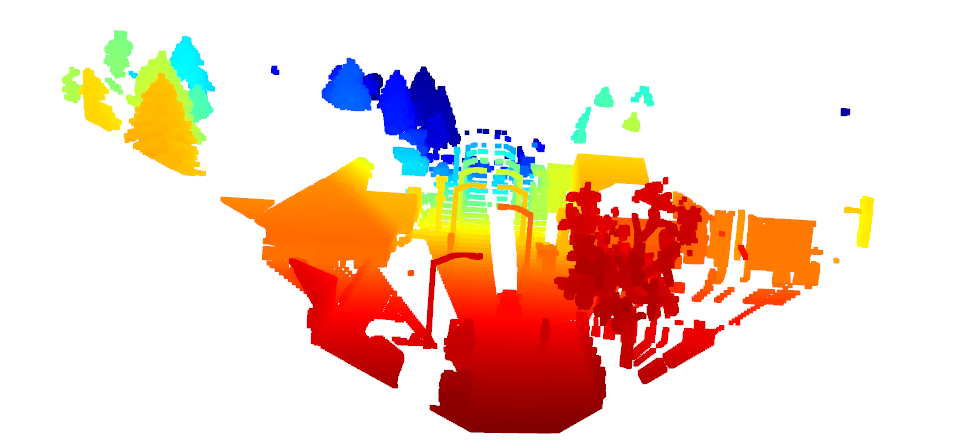
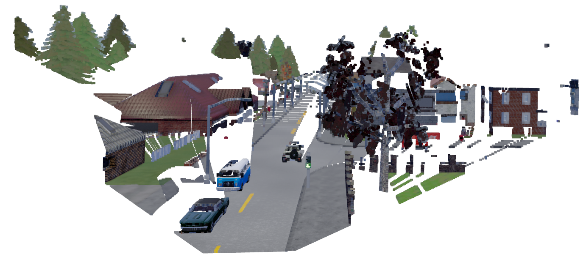
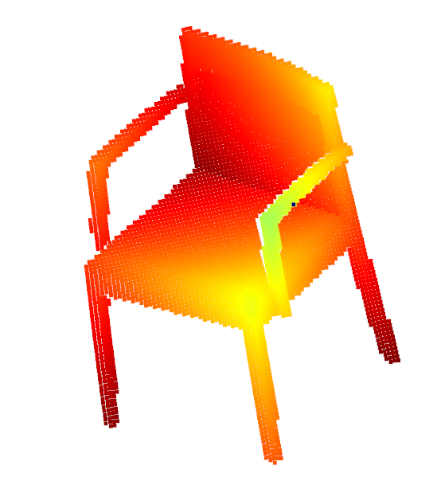
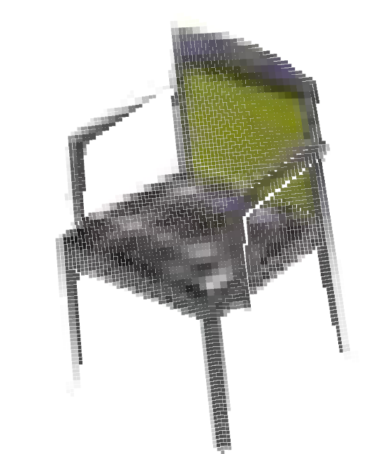
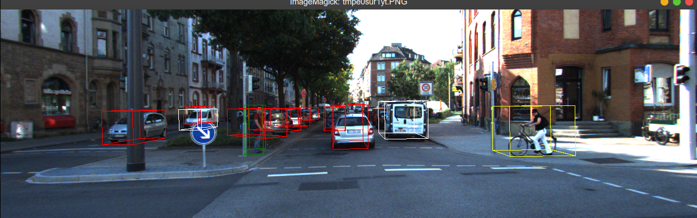

# Projection Transformation

##1. Inverse projection

For more information, you can see README.md inside folder `./inverse_projection`.

### Dependency installation 
I use open3d for visualizing the point clouds
```python
pip install open3d
```

### How to use

I have 4 examples code:

```python
python3 inverse_project.py 
```
This code will plot 3D point cloud of the depth image: `./inverse_projection/data/depth.exr` as shown bellow:



```python
python3 open3d_visualize.py
```
This code will plot 3D point cloud and each point have the RGB color as in the `./inverse_projection/data/rgb.png` as shown bellow:



```python
python3 chair_pcl_visualize.py
```
This code will plot 3D point cloud of the depth image inside: `./inverse_projection/data/1a6f615e8b1b5ae4dbbc9440457e303e.mat` as shown bellow:



```python
python3 chair_pcl_visualize_with_rgb.py
```
This code will plot 3D point cloud and each point have the RGB color as in the `./inverse_projection/data/1a6f615e8b1b5ae4dbbc9440457e303e.npy` as shown bellow:



## 2. Lidar Camera Projection

For more information, see the README.md: `./lidar_camera_projection/data/README.md`
This part I learn to perform Camera Projection through many coordinate systems, as well as know more about the KITTY Dataset.
These will help me a lot in the current project.

### My experiments

Run
```python
python3 kitti_3dobj_visualize.py
```

This will render the 3D bounding box for each detected entity in the image: 



Next, I will implement code for the rest of this process. 