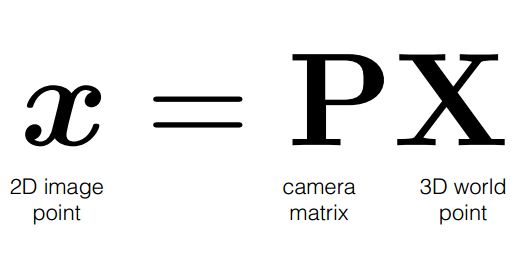
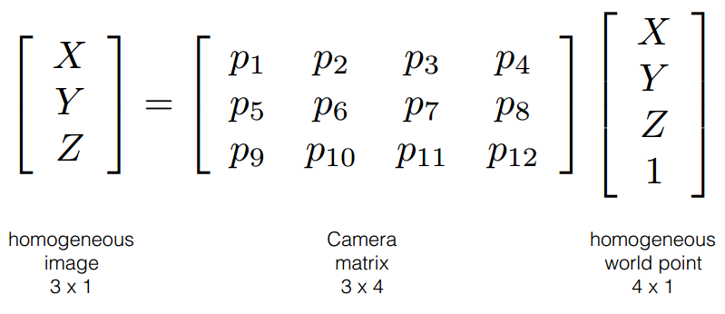
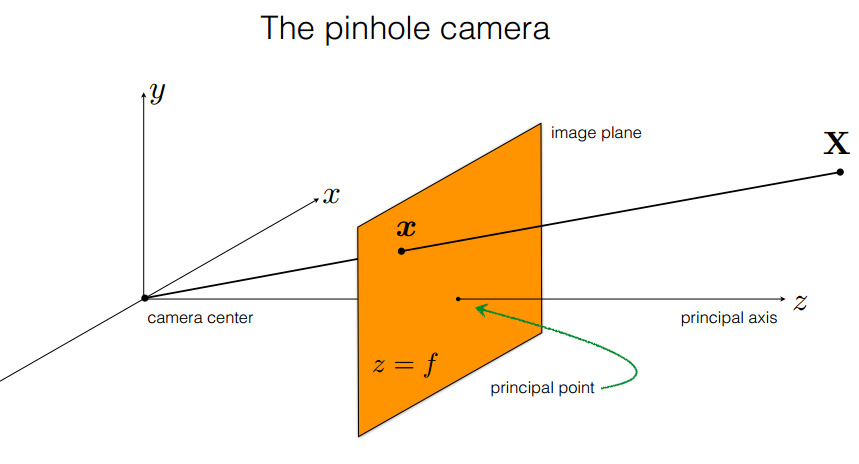
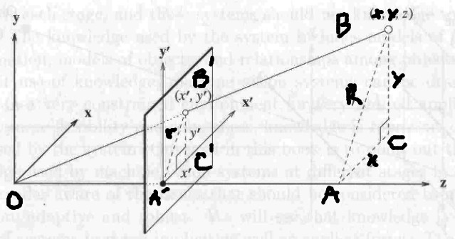
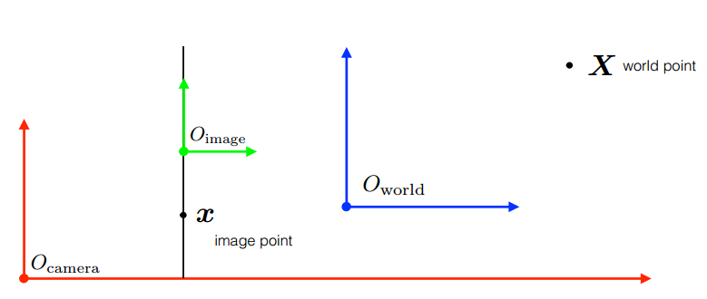
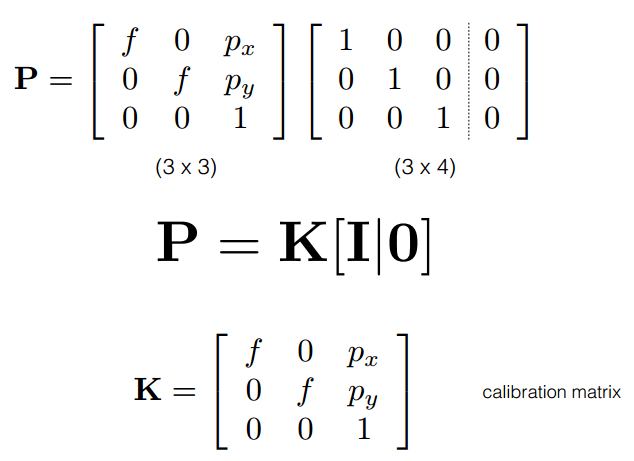
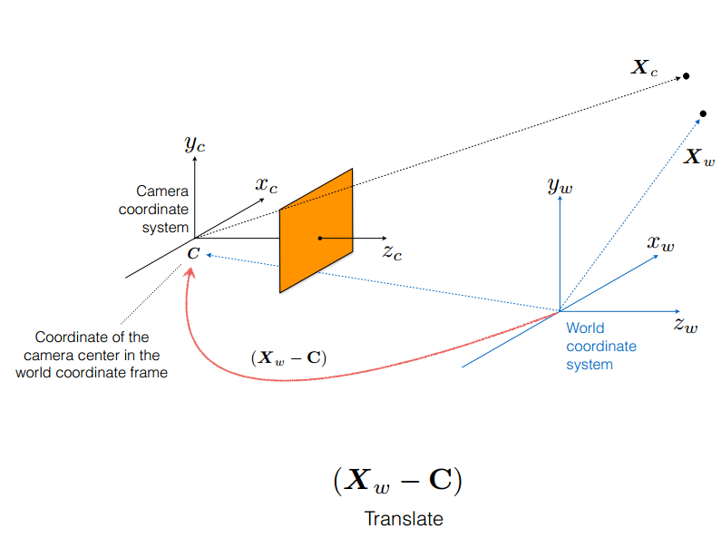
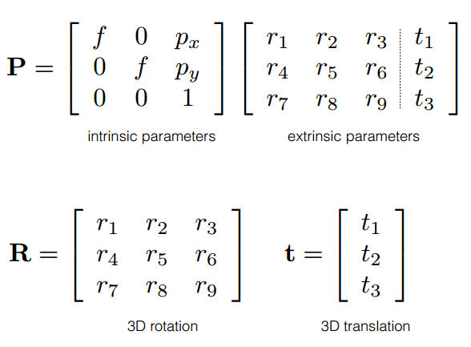
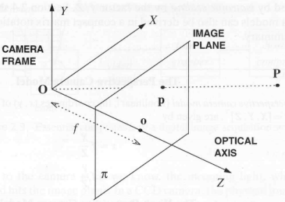

# Inverse projection transformation


## 1. Camera mapping 

A camera is a mapping between the 3D word and a 2D image as: 



And in Homogeneous coordinate:



Here, we consider the simplest pinhole camera model with no skew or distortion factor.



We can find the equations of the perspective projection



From OA'B' and OAB we have:  


From A'B'C' and ABC we have:


Then **perspective projection equation**:


Using matrix notation:


Verify the correctness of the above matrix (homogenize using w=Z)


Because we the image on the 2D image plane, then the z coordinate of the 3D point in the image plane is f, we just want
the x, and y coordinate on the image, the above matrix equation can minimize at:


One thing that we should know that the image root is not coincides with principal point, let's call the principal point 
coordinate on image plane is  , then our matrix equation becomes:


In general, there are **three different** coordinate systems related to map the point in real word into a point on 2D 
image:



so we need to know the transformations between them

The projection matrix P can decomposed into two matrices:



Let's assume that the camera and word share the same coordinate system, then we have the exactly what we have on the above.
But if they are different, we must align them by using Rigid transformation


Translation in H.C:



In homogeneous coordinates, this can be done by:


When we apply them, we get the general mapping of a pinhole camera:


And in Matrix form: 



## 2. Properties of perspective projection

### Many-to-one mapping:

The projection of a point is not unique (any point on the light ray has the same projection)



On the above image, all points on OP line have the same projection p on image plane.

### Scaling/Foreshortening
### Effect of focal length 

* As f gets smaller, more points project onto image plane (wide-angle camera)
* As f gets larger, the field of view becomes smaller (more telescopic)

### Lines, distances, angles

* Lines in 3D project to lines in 2D.
* Distances and angles are **not** preserved.
* Parallel lines **do not** in general project to parallel lines (unless they are parallel to the image plane).

### Vanishing point, vanishing line 

## 3. Inverse projection

From the given formular, suppose that we no need to consider the extrinsic matrix [R|t]. 

Then the u, v of point (X, Y, Z, 1) in the camera coordinate on the image plane is: 


Then we can easily compute the X, Y of the point in real-word:


In above equation, we need (u,v) coordinate of pixel on image, also the Z-depth image to recover the points in word coordinate.

Pseudo-code:
```python
cam_points = np.zeros((img_h * img_w, 3))
i = 0
# Loop through each pixel in the image
for v in range(height):
    for u in range(width):
        # Apply equation in fig 5
        x = (u - u0) * depth[v, u] / fx
        y = (v - v0) * depth[v, u] / fy
        z = depth[v, u]
        cam_points[i] = (x, y, z)
        i += 1
```

Using Matrix Algebra: 
```python
cam_coords = K_inv @ pixel_coords * depth.flatten()
```

## References 
1. [Projective Camera Model](https://www.imatest.com/support/docs/pre-5-2/geometric-calibration-deprecated/projective-camera/)