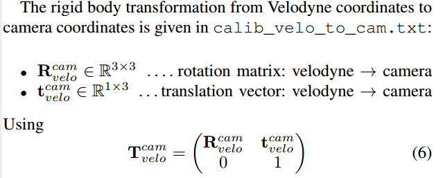

About the data
================================

This is a part of KITTI 3D Object Detection Dataset

There are 4 different types of files from the KITTI 3D Object Detection dataset as follows are used in the /data folder:

* 000114.bin (is the velodyne point cloud)
* 000114_calbib.txt (the camera calibration)
* 000114_image.png (image)
* 000114_label (label of objects in the image)

## Coordinates


This figure illustrate the coordinate system of the annotated 3D bounding boxes w.r.t the coordinate system of 3D Velodyne 
laser scanner. In z-direction, the object coordinate is located at the bottom of the object

## Label File

The label file contains the bounding box for objects in 2D and 3D in text. Each row in the file is one object and 
contains 15 values, including the tag. The 15 columns represent:


| Values        | Name      |Description|
| -----------   | ----------| ----------|
| 1             | Title     | Type of object: 'Car', 'Van', 'Truck', Pedestrian', 'Person_siting', 'Cyclist', 'Tram', 'Misc' or 'DontCare'
| 1 | Truncated        |Float from 0 (non-truncated) to 1 (truncated), where truncated refers to the object leaving image boundaries
|1|occluded| integer (0, 1, 2, 3) indicating occlusion state: 0 = fully visible, 1 = partly occluded, 2 = largely occluded, 3 = unknown
|1|alpha|Observation angle of object, ranging [-pi, pi]
|4|bbox|2D bounding box of object in the image (0-based index): contains left, top, right, bottom pixel coordinate
|3|dimensions|3D object dimensions: height, width, length (in meters)
|3|location|3D object location x, y, z in camera coordinate (in meters)
|1|rotation_y|Rotation ry around Y-axis in camera coordinate [-pi...pi]
|**1**|**score**|**Extended - only for results: Float, indicating confidence in detection, needed for p/r curves, higher is better** 


Example: 

Car 0.00 0 -1.59 589.01 187.21 668.42 253.27 1.36 1.69 3.38 0.35 1.73 17.14 -1.57

* Car: type
* 0.00: non-truncated
* 0: non-occluded
* -1.59: alpha (in radius)
* 589.01 187.21 668.42 253.27: bounding box in 2D image
* 1.36 1.69 3.38: 3D object dimension (in meters)
* 0.35 1.73 17.14: object location in camera coordinate
* -1.57: rotation_y


Here, there is a note about them: 

**Rotation_y** is directly given in camera coordinate, while alpha also considers the vector from the camera center to the 
object center, to compute the relative orientation of the object w.r.t the camera. An example: 


In the figure, Rotation_y is the ry.

A car which is facing along the X-axis of the camera coordinate system corresponds to the ```rotation_y = 0```, no matter
where it is located in the X/Z plane (bird's eye view), while alpha is zero only when this object is located along the 
Z-axis of the camera. Then when moving the car away from the Z-axis, the observation angle will change.

Rotation_y: is the yaw, in the concept of the setup of LIDAR this is the Z axis rotate in Velodyne Coordinates

**Alpha - Observation angle of object:**
From [[8] in References](#references)


The ```observation angle``` in this case is the $\theta_{l}$, this can be calculated by calculating the direction vector 
of the blue one and red one.

## Calibration file

Contains intrinsic and extrinsics of the sensors.

P0: 12 items (size 3 * 4)
P1: 12 items
P2: 12 items
P3: 12 items
R0_rect: 9 items
Tr_velo_to_cam: 12 items
Tr_imu_to_velo: 12 items

* P0, P1, P2, P3 are projection matrices- defined by something like
```P1 = calibration_matrix * [R_1|T_1]```
or in the form:
```P1=calibration_matrix*[R_1.transpose() | -R_1.transpose()*T_1] ```

Tr is the concatenation of 4 translation matrices ```P0, P1, P2, P3``` and the question is it represent in which form: 
```T_i``` or ```-R_i.transpose()*T_i```

Here, i ∈ { 0 , 1 , 2 , 3 } is the camera index, where 0 represents the left grayscale, 1 the right grayscale, 2 the left color and 3 the right color camera.

From [[4] in References](#references):

* P_X: matrices project a point in the rectified referenced camera coordinate to the camera_x image. Camera_0 is the 
referenced camera coordinate.

* R0_rect: is the rectifying rotation for referenced coordinate (rectification makes images of multiple cameras lie on the
same plan)

* Tr_velo_to_cam: maps a point in point cloud coordinate to reference coordinate

So the projection matric maps a point from Velodyne coordinate into camera_2 image (for example) is: 

```cam2_image = P2 * R0_rect * Tr_velo_to_cam * x_velo_coord```

More specifically: 

```python
P2            = [[7.215377e+02 0.000000e+00 6.095593e+02 4.485728e+01]
                 [0.000000e+00 7.215377e+02 1.728540e+02 2.163791e-01]
                 [0.000000e+00 0.000000e+00 1.000000e+00 2.745884e-03]]

R0_rect       = [[ 0.9999239   0.00983776 -0.00744505  0.        ]
                 [-0.0098698   0.9999421  -0.00427846  0.        ]
                 [ 0.00740253  0.00435161  0.9999631   0.        ]
                 [ 0.          0.          0.          1.        ]]

Tr_velo_to_cam = [[ 7.533745e-03 -9.999714e-01 -6.166020e-04 -4.069766e-03]
                  [ 1.480249e-02  7.280733e-04 -9.998902e-01 -7.631618e-02]
                  [ 9.998621e-01  7.523790e-03  1.480755e-02 -2.717806e-01]
                  [ 0.000000e+00  0.000000e+00  0.000000e+00  1.000000e+00]]

```

And from [[6] in References](#references):

* vel_to_ref: rotate & translate point from velodyn coord to reference camera (cam0) coordinate. (this is the 'Tr_velo_to_cam'), in the data they provided the $R_{velo}^{cam}$ and $t_{velo}^{cam}$


* ref_to_cam: is the rectifying rotation for referenced coordinate (rectification makes images of multiple cameras lie on the
same plan) (this is the 'R0_rect') (**this is also known as the rotation matrix to map from object coordinate to reference coordinate**)

* cam_to_img: rotate & translate point from main camera (cam2) coord to image pixel coord. (this is the 'P2')

* Then the chain of transformation is describe as: 
$y = P_{rect}^{(i)}.R_{rect}^(0).T_{velo}^{cam}.x$ with x is the point in velodyne coordinate.

```Ok, I think 3 lines above are the best definition for those parameters``` 


We can see that: 

* R0_rect is the pure Rotation matrix in Homogenerous Coordinate
* P2 in the form of: 
```python
    P(i)rect = [[fu  0  cx  -fu*bx],
                [0  fv  cy  -fv*by],
                [0   0   1  0]]
```
with fu, fv are focal lengths, cx, cy are the pricipal point coorinate wrt the root coordinate of image plane.
and bx is the baseline in meters w.r.t the reference camerea 0. The sensor setup here: 


Then the bx between camera 0 and camera 2 is: 0.06m 
Then ```-fu * bx = -7.215377e+02*0.06 = -43.292262 ~= 4.485728e+1``` (I don't know why the negative here ???, maybe the formular)

## Bin File

For efficiency, the Velodyne scans are stored as floating point binaries that are easy to parse using the C++ or MATLAB. 
Each point is stores with each (x, y, z) coordinate and an additional ```reflectance value (r)```. 

Note that the Velodyne 
scanner rotates continuously around its vertical axis (counter-clockwise) which can be taken into account using the 
timestamp files.

The bin file after reshape into (-1, 4) then it has 120002 point, each point in the form of (x, y, z, r) and r is the 
reflection value, see [[7] in References](#references)


## Bounding Box Visualization 

In label file, we have the 3D bounding box for an object. Then we can using projectve to achive it in 2D image on camera 2.
This can be done because we have: 
* 3D box - a set of 8 points in object coordinate.
* We have the rotation_y as well as the translation to make the object coordinate become the **reference camera coordinate** - in this case 
we play with the camera 2 (notice
that we have 4 camera, 1 called Velodyne and one called IMU)
* The rectifying rotation matrix of the reference camera must be considered as well to project a 3D point in reference 
camera coordinates to a point y on the i'th image plane.

For these reason, the equation to projecting the 3D bounding boxes in references camera coordinate to camera_2 image: 
```y_image = P2 * R0_rect * x_ref_coord```

with 

```x_ref_coord = [R0_rot_y|T] * x_object_coord```

### Need understand these values: 
- [x] Alpha
- [x] Rotation_y
- [x] Calibration file
- [x] Reflecten value r in Velodyne scan
- [ ] The sign of formular for P_X matrix
- [x] Try to understand the Tr_velo_to_cam matrix, because the explanation is ambigious.


## References:
1. [Official KITTI Dataset](http://www.cvlibs.net/datasets/kitti-360/documentation.php)
2. [KITTI Camera Calibration file](https://stackoverflow.com/questions/50210547/format-of-parameters-in-kittis-calibration-file)
3. [Vision meets Robotics: The KITTI Dataset](https://www.mrt.kit.edu/z/publ/download/2013/GeigerAl2013IJRR.pdf)
4. [Explanation - KITTI 3D Object Detection Dataset](https://medium.com/test-ttile/kitti-3d-object-detection-dataset-d78a762b5a4)
5. [Explanation - P_X matrix](https://stackoverflow.com/questions/58918538/how-kitti-calibration-matrix-was-calculated)
6. [Source Code No.1](https://github.com/kuangliu/kitti-utils/blob/master/calibration.py)
7. [LRV - Light Reflectance Values](https://blog.1000bulbs.com/home/what-are-light-reflectance-values)
8. [Explain about observation angle of object](https://github.com/NVlabs/Deep_Object_Pose/issues/86)